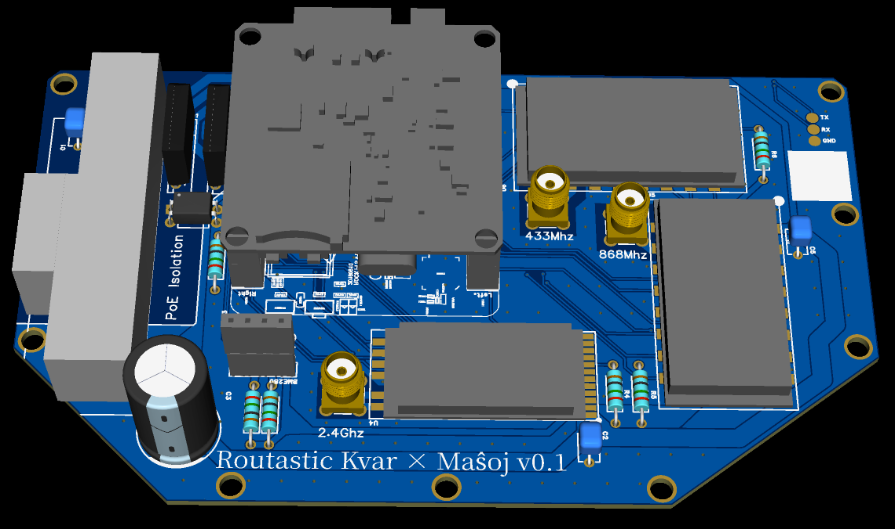

# Routastic - offgrid open-source communication written in Go

Routastic is an experimental P2P offgrid mesh communication platform that aims to be compatible with [Meshtastic](https://meshtastic.org/) protocol while providing improvements in congested networks through intelligent packet routing and extensible PHY layer.

Routastic routers monitor and learn about the mesh in order to make decisions when routing frames as well as use a multiband architecture allowing them to use faster backhauls (P2P WiFi, 2.4GHz [LoRa](https://en.wikipedia.org/wiki/LoRa), ...) aiming to make it applicable in more use cases by improving throughput and reducing congestion.

# Software

*WIP*

# Hardware

## Kvar × Maŝoj

This is an experimental PoE-powered node that is able to bridge four physical meshes together:
- Long Range `WayFartherThanYouCouldEverKnowWhatToDoWith` ~ 10Km [LoS](https://en.wikipedia.org/wiki/Line_of_sight)
    - [LoRa](https://en.wikipedia.org/wiki/LoRa)
        - 2.4GHz
        - 868MHz
        - 433MHz
- Short range <1km:
    - WiFi ([IBSS](https://en.wikipedia.org/wiki/Independent_basic_service_set))
    - BLE\*

\* BLE needs tests and its coexistence with WiFi even more so.

Construction is currently *WIP*, CAD files, part selection, and build instructions to be released one day.

## DiY

`$ADD_YOUR_OWN`

Runs on Linux, should be compatible with pretty much any SBC & SOM with [`spidev`](https://www.kernel.org/doc/Documentation/spi/spidev) and [`/dev/gpio`](https://docs.kernel.org/driver-api/gpio/using-gpio.html) support.

You can then hook up a LoRa modem such as SX1262, SX1268, or SX1280.

# Timeline

This project is currently in an extremely early stage, and many pieces are still lacking.

Here is the current timeline; keep in mind I am working on this for fun as a side project and this is not any promises:
- ✅ Nov 2024, design hardware prototype
- 📌 Dec 2024, hardware prototype assembly
- 🎯 Feb 2025, working prototype (software + hardware) for [@FOSDEM 2025 Meshtastic's booth](https://fosdem.org/2025/news/2024-11-16-stands-announced/)
- 🎯 Mar 2025, v1 release, will not mean stable, will mean good enough to run and deploy your Mesh routers on, but I hope Meshtastic users accept and understand some jank and experimental status.